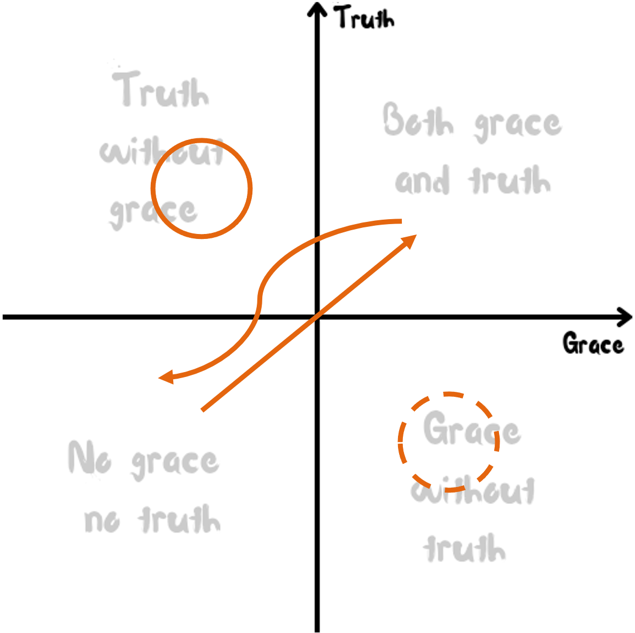
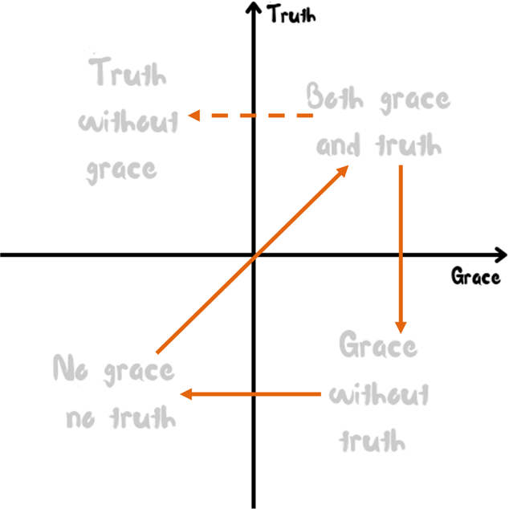

# Planted. 2025 — Week 1

## Week 1 Program: The Grid

**Set up:** Prepare some ropes, snacks, and drinks (preferable something sweet, cheesy, and sodas). Use the ropes to form a matrix with 4 quadrants. Place the snacks and drinks next to the bottom right corner.

**Instructions:** The duration of this activity is around 20 minutes. Participants will be asked to do different activities in 3 of the 4 quadrants.

> Top left corner – doing burpees or jumping jacks. Requiring perfect form and a perfect smile on your face.
> Bottom left corner – squat down or sit down, turn back from everyone else, close your eyes, cover your ears, say "I'm not listening", "I don't care", "leave me alone" etc.
> Bottom right corner – unlimited amount of snacks and drinks, and you must keep eating. You can toss snacks to other groups to disturb them though.

Participants can switch quadrants anytime they want, but you can't take breaks from activities.

Program Facilitator can encourage participants to stay in each quadrant for longer than 5 minutes. (That's how they usually experience new feelings, different from when they start in a new quadrant.)

At the end of 20 minutes, invite all the participants to take a break in the top right corner.

**Discussion** (Take time because we want deep, engaging conversations. Make sure everyone's voice is heard):

1. How do you feel? (when you started in a new quadrant vs. staying there for a while)
2. What do you think each quadrant represents?
   - Top left – performance/perfectionism/religion
   - Bottom left – isolation
   - Bottom right – total excess/indulgence
   - Follow-up questions: in what relationship do you tend to respond in what way? (relationships with parents/friends/boss/coworkers/strangers)
3. What do the x-axis and the y-axis mean? What do you think the top right quadrant represents? (our natural responses vs. the supernatural way)

> "To be loved but not known is comforting but superficial. To be known and not loved is our greatest fear. But to be fully known and truly loved is, well, a lot like being loved by God. It is what we need more than anything. It liberates us from pretense, humbles us out of our self-righteousness, and fortifies us for any difficulty life can throw at us."
> ― Timothy Keller

## Framework 1: The Grace-Truth Matrix

**Questions:**

- What is truth? (famous question of Pilate – John 18:38)
- What is grace?
- What do they mean to you?
- What are some relationships between them?

**Definitions:**

- **Truth** – objectively, universally, what is true in any matter under consideration. Of a truth, in reality, in fact, certainly. Truth does not depend on whether we believe it or not.
- **Grace** – *charis* in Greek. The divine influence upon the heart and its reflection in life – acceptable, benefit, favor, gift, joy, liberation, pleasure, thanks. Grace is something we don't deserve, we can't earn, but freely receive from God.

**Scriptures:**

- **John 1:14** — The Word became flesh and made his dwelling among us. We have seen his glory, the glory of the one and only Son, who came from the Father, full of grace and truth.
- **John 8:31–32 (NLT)** — Jesus said to the people who believed in him, "You are truly my disciples if you remain faithful to my teachings. And you will know the truth, and the truth will set you free."
- **John 18:37b** — "For this purpose I was born and for this purpose I have come into the world—to bear witness to the truth. Everyone who is of the truth listens to my voice."
- **John 3:17** — For God did not send his Son into the world to condemn the world, but to save the world through him.
- **Ephesians 2:8 (NLT)** — God saved you by his grace when you believed. And you can't take credit for this; it is a gift from God.
- **1 Corinthians 13:2** — If I have the gift of prophecy and can fathom all mysteries and all knowledge, and if I have a faith that can move mountains, but do not have love, I am nothing.

**Deeper insights:**

- "Truth without grace is mean, grace without truth is meaningless, but truth and grace together are good medicine." – Chris Hodges
- Truth is seeing the good, the bad, the ugly; grace is embracing them.
- In a relative world, everyone seems to have their own "truth", but there is an ultimate truth – the fact of God loves you.
- Grace meets you where you are, but it does not just leave you there. God loves you too much to let you stay the same.
- Truth sets us free; grace invites us into that freedom.

**Applications:**

1. A lens for studying Bible
   - e.g. people's attitude towards Jesus: religious leaders, the crowds, people who wanted to take advantages on Jesus, the disciples.
   - e.g. the parable of sowing seeds
2. A dynamic structure
   - e.g. Job

     

   - e.g. the parable of the prodigal son

     

3. A wisdom of life – love, boundary, forgiveness, humility, peace, discipline, freedom – a lot of things that are good, beautiful, and true are the combination of grace of truth.
