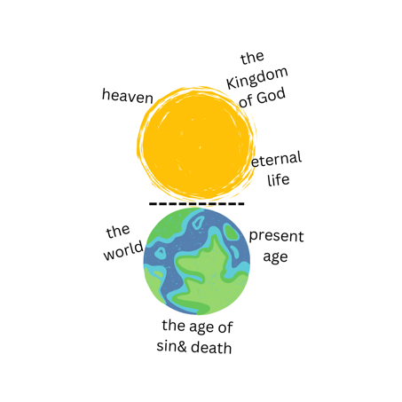

# Planted. 2025 — Week 12: Eternity Planted

## Greeting & introduction

Welcome to Planted. Bible study group. We are going through a 5 chapter, 15-week curriculum called Planted. Now we are at the end of Chapter 4. The other chapters (titles – theme – forms) are:

1. There Is a Garden Named Delight (creation & humanity) – devotional Bible study
2. Devil Not Today (sin & spiritual warfare) – discovery Bible study
3. Breakdown Is the Beginning of Breakthrough (life, death & resurrection of Jesus) – story telling, sharing our testimonies & the story of Jesus
4. See the Other Side (perspective shift, the vision & mission of Jesus) – messages, the Kingdom perspective & eternal perspective
5. From Planted to Plant (the abundant life & evangelism) – discipleship training

*[Leader self-introduction omitted in this public copy.]*

**Opening prayer:** God, open our eyes and hearts so that we can see your presence in our room. Thank you bringing us here safely. We dedicate the time of the little message tonight to you. Thank you for your love, out of which you created us, saved us, and gave us the citizenship of the Kingdom of Heavens. God, we don't take that love for granted. Have your way, speak to us, challenge our hearts. We love you with all of our soul, strength, and mind. In Jesus' beautiful name I pray, amen.

## Key points

- "The union of heaven and earth is what the story of the Bible is all about." – The Bible Project
- God's longing for dwelling with His people is a constant theme in the Bible. Eden was called paradise because God dwells within His creation. God's posture of humility was revealed from the very beginning of the story. Throughout the Bible, from the pillar of cloud and fire to the tabernacle and the holy of the holies, to the temple of Israel and each one of us – the temple for the Holy Spirit, God never stopped pursuing our hearts. God still longs for dwelling among us again. He sent His one and only Son to the world to be Emmanuel, which means God with us.
- **John 1:14** — The Word became flesh and made his **dwelling** among us. We have seen his glory, the glory of the one and only Son, who came from the Father, full of grace and truth. (The word dwell in Greek means to live in a tent, to tabernacle.)
- **Revelation 21:1–4** — Then I saw "a new heaven and a new earth," for the first heaven and the first earth had passed away, and there was no longer any sea. I saw the Holy City, the new Jerusalem, coming down out of heaven from God, prepared as a bride beautifully dressed for her husband. And I heard a loud voice from the throne saying, "Look! God's **dwelling** place is now among the people, and he will **dwell** with them. They will be his people, and God himself will **be with** them and be their God. 'He will wipe every tear from their eyes. There will be no more death' or mourning or crying or pain, for the old order of things has passed away."
- Help me finish one of the most important verses in the Bible – John 3:16 – "For God so loved the world that he gave his one and only Son, that whoever believes in him shall not perish but 'go to heaven after we die'?" Not that way right? What Jesus offers is the eternal life. There's never a statement in the Bible that indicates that we will go to heaven, especially "after we die". Rather, the Bible teaches us about the presence of God and God's heart to dwell with His people all the time. Heaven is where the presence of God is, and Jesus is the full embodiment of the presence of God, the image of the invisible God (Colossians 1:15). "Going to heaven after you die" becomes a bad theology because it creates a mindset of escapism, denying God's ongoing work of salvation in this broken world. Believing in Jesus is not a means to an end, it is its own end. The only the best reward of our faith is the relationship with the personal God, not just a place for our "afterlife". Today many Christians are paralyzed by the thought of "once you are saved, you are always saved". Yes, nothing can take away your salvation, but salvation should not be your ultimate goal – it's not the finish line, but the start line of the abundant life. Heaven is not your ultimate goal neither, don't let the wrong focus make you miss out the One who makes heaven heaven.
- **Discussion question:** how do you understand the eternal life? *(time for discussion)*
- Let's look at some definitions:
  1. **Finite:** having limits or bounds. It's not hard to figure out that humans are temporal, mortal beings. We are "conditioned by time" as Augustine pointed out in the *Confessions*. The Bible has taught us the wisdom of numbering our days: **Psalm 90:12** — Teach us to number our days, that we may gain a heart of wisdom.
  2. **Eternal:** something that will go on forever. It includes eternal past and eternal future.
  3. **Infinite (or everlasting):** something that has no limit or an end.

  > When we connect both eternal past and the eternal future, we get eternity. Eternity is a unique trait that in the Bible usually only refers to God. **Psalm 90:2b** — from everlasting to everlasting you are God.

- The human history has a beginning and is going to an eternal destination. The opening of the Bible indicates the infinitude of God: "In the beginning, God…", which means eternity – God's time – is outside of our time. This is why our past, present, and future are all present in God's eyes, and He can be present in any moment of human history. Where heaven and earth overlap is not just the Kingdom come, but also where eternity intersects human history.
- But what the Bible talks about the eternal life breaks the dimension of our time.

  > **Ecclesiastes 3:11 (NLT)** — Yet God has made everything *beautiful* for its own time. He has *planted* eternity in the human heart, but even so, people cannot see the whole scope of God's work from beginning to end.

  Eternity has already been planted in our hearts, and we are eternal beings! But how could our finite minds comprehend this infinite God character? This is a mystery of God. If a mystery is fully known, is it still mystery? The New Revised Standard Version Bible (include more words that are easier to understand) gives us some plain understanding of this verse:

  > **Ecclesiastes 3:11 (NRSV)** — He has made everything *suitable* for its time; moreover he has put *a sense of past and future* into their minds, yet they cannot find out what God has done from the beginning to the end.

  NRSV simply put a sense of past and future here to explain eternity. Does it make sense for the eternal past and the eternal future we just talked about a minute ago? And the word "suitable" is beautifully used here. When the right things being done in the right time, it's good and beautiful. "The time is always right to do what is right." – Dr. Martin Luther King Jr.

  I just can't get over the word "planted" being used in the New Living Translation. I think plants would be the teacher for us of the course of eternity. If you are a green thumb, you know how important it is to embrace the scissors. When you propagate a plant, you can just cut below the nodes, stick the branch in water, sphagnum moss, pearlite, or any other media, and it'll grow roots from the nodes and become a new plant. In that sense of the continuation of life, we could say plants are eternal beings.

- The only definition of the eternal life is from Jesus' prayer for his disciples in John 17: this is eternal life: that they know you, the only true God, and Jesus Christ, whom you have sent (John 17:3). According to Jesus, the eternal life is not just based on knowledge but also relational intimacy. Not "knowing about" God like knowing about a famous person, but "knowing" like knowing a friend, which takes time to build that kind of relationship. This relationship with God changes the trajectory of our life to a different eternal destination from eternal separation and destruction but an eternal destination that we get to do life with God.
- So, what is the eternal life? Is it immortality or infinite amount of time? Maybe it's not "one or the other", but "both and". Eternity is both time and life. *Eternity is life with God and is beyond the limitation of the dimension of time.* Jesus died on the cross two thousand years ago, but today we can have relationship with him, this is an eternal relationship. This is the eternal life. Eternity does not start after you die; it starts when you accept Jesus as Lord and Savior. That's the moment when the trajectory of your life is forever changed.
- Go with the flow of Holy Spirit.

**Prayer session** – 7:50 – 8:15

## Announcement

1. Family dinner next week and we will have barbecue provides by Red Rocks groups ministry.
2. Group launch – future group leaders needed!

---

## Source Extraction — Session S8 (Eternity Planted pilot)

*(Appended in Notion as part of the AGENTS.md SOP pilot.)*

### 1) Source identity

- **Title:** Planted. 2025 Week 12
- **Version / Year:** 2025
- **Source Type:** Session Draft
- **Language:** English

### 2) Core claims

- The Bible's storyline is framed as the **union of heaven and earth** (explicitly quoted/attributed in the source).
- God's desire to **dwell with** God's people is presented as a constant thread (Eden → tabernacle → temple → Holy Spirit indwelling → Emmanuel).
- "Going to heaven after you die" is critiqued as a mistaken emphasis that can produce **escapism** and obscure God's ongoing work of salvation in the world.
- Salvation is framed as the **start line** of abundant life (not merely "getting saved" as the finish line).
- Ecclesiastes 3:11 is used to argue that **eternity is planted in the human heart** and calls for an "eternity perspective."
- John 17:3 is used as the *definition* of eternal life: knowing the only true God and Jesus Christ relationally, not merely "knowing about."

### 3) Key passages (only those used in this source)

- **John 1:14**
- **Revelation 21:1–4**
- **John 3:16**
- **Colossians 1:15**
- **Psalm 90:12**
- **Psalm 90:2**
- **Ecclesiastes 3:11**
- **John 17:3**

### 4) Biblical-theological themes

- Eternal life (relational, begins now)
- God's presence / God dwelling with people
- Heaven and earth (overlap → reunion)
- Kingdom (citizenship language + "Kingdom of Heavens" framing)
- Already and not yet (implicit in "already planted / not yet fully seen" tension)
- Time (finite/eternal/infinite distinctions; "conditioned by time")
- New creation (via Revelation 21)

### 5) Strong original language (preserve)

- "The union of heaven and earth is what the story of the Bible is all about."
- "Heaven is where the presence of God is."
- "Salvation should not be your ultimate goal — it's not the finish line, but the start line of the abundant life."
- "Don't let the wrong focus make you miss out the One who makes heaven heaven."
- "Eternity is life with God and is beyond the limitation of the dimension of time."
- "Eternity does not start after you die; it starts when you accept Jesus as Lord and Savior."

### 6) Discussion material

- Explicit discussion question:
  - "How do you understand the eternal life?"
- Teaching prompts:
  - "Help me finish… John 3:16…" (used as a corrective prompt in the source)
- Definitions segment (teaching tool):
  - Finite / Eternal / Infinite (or everlasting)
  - "Eternity… usually only refers to God" (as phrased in the source)

### 7) Formation applications

- Cultivate an "eternity perspective" that produces:
  - **urgency** (mission; concern for those heading toward "eternal perishment"; "unreached groups")
  - **patience** (forgiveness; letting go; prioritizing God's presence)
- Prayer emphasis: asking God to open eyes/hearts to God's presence "in our room."

### 8) Unique contribution

- Provides a **session-ready teaching flow** (intro → prayer → key points → discussion → definitions → application).
- Uses the fixed Session 8 key passages explicitly: **John 17:3** and **Ecclesiastes 3:11** (and gives interpretive moves to connect them to formation).

### 9) Repetition (duplicated across Session 8 sources)

- "God dwelling with people" thread (also in Already/Not Yet EN and See The Other Side).
- Corrective against "go to heaven after you die" framing (also in See The Other Side).
- "Eternity begins now" language (also in See The Other Side).

### 10) Human Review Needed

- **Overstated wording risk:** statements like "There's never a statement in the Bible that indicates that we will go to heaven… especially 'after we die'" should be reviewed for precision and tone before integrating into canonical Leader Notes.
- **Conceptual clarity:** distinguish carefully between "heaven as presence," "new creation (new heaven & new earth)," and "eternal life begins now," to avoid conflation.
