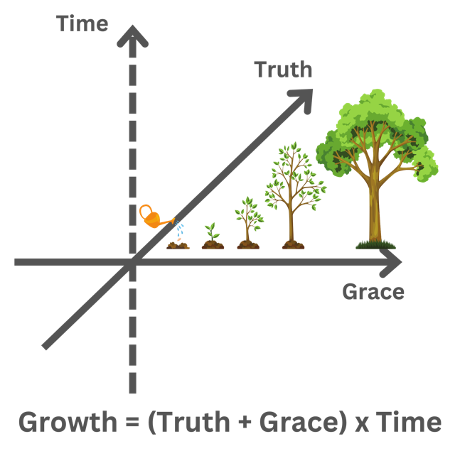

# Planted. 2025 — Week 13 Program: The Bond

*[Photo of participants doing the activity — kept in Notion only.]*

**Set up:** We need an open space and a rescuing rope bag.

## Instructions

### Preparation

- We will begin by standing in the middle of the room and forming a close circle.
- The Program Facilitator will choose a person (like somebody who's a great communicator, or with a strong personality, or some leadership traits) to be the *first* Question Initiator.
- If you become a Question Initiator, you are going to hold the end of the rope and toss the rope bag randomly to a person in the circle, and then ask a question in order to know more about that person.
- We will do two rounds with slightly different instructions, and form two patterns of bonds.

### Round 1

- The *first* Question Initiator will be the Question Initiator for the whole time in this round.
- Start to toss the rope bag and ask questions.
- The person who catches the rope bag will answer the question, hold an end of the rope, and toss the rope bag back to the Question Initiator.
- Repeat that process till everyone is asked, or the length of the rope runs out. Then toss the rope bag to the first Question Initiator.
- Now we need some team effort here. Everyone holds the end(s) of the rope in their hands. We will try to lean back, squat down at the same time, and then get back up together.

### Round 2

- In this round, the person who catches the rope bag becomes the *new* Question Initiator.
- After catching the rope bag and answering the question, the *new* Question Initiator will hold an end of the rope, toss the rope bag to anybody, and ask any question.
- Repeat that process till everyone is asked, or the length of the rope runs out. Then toss the rope bag to the *first* Question Initiator.
- Again, we will hold the rope tightly, try to lean back, squat down at the same time, and then get back up together.

## Discussion

(tips: really take time because we want deep, engaging conversations. Make sure everyone's voice is heard)

1. What's the difference between the two patterns we formed?
2. Which one is stronger?
3. Maybe ask the *first* Question Initiator, how do you feel in each round?
4. What are the advantages and disadvantages of each pattern?
5. What could the bond stand for?

## Key Points

- Bond – unity, the firm foundation
- Ephesians 4
- **John 13:34–35** — "A new command I give you: Love one another. As I have loved you, so you must love one another. By this everyone will know that you are my disciples, if you love one another."
- Interdependence – connections, community, growing together
- Wisdom in leadership – letting go
- (transition to trees → forest)

---

## Page 2

### Last week recap

### Fun Activity

Everybody draws a big tree and represents what "abundant life" means to you.

(**Isaiah 65:22** — For as the lifetime of a tree, so will be the days of My people.)

> When we put the trees together, what do we see? A forest.
> Don't miss the forest for the trees.
> Tree - individual spiritual growth
> Forest - the church, the body of Christ, community, life together

### Draw the line

1. There Is a Garden Named Delight - the beginning of the story of a seed;
2. Devil Not Today - the seed being buried in darkness;
3. Breakdown is the Beginning of Breakthrough - because of death and resurrection of Jesus brought the hope for life, the seed sprouted;
4. See the Other Side - when we see the other side of the Kingdom and eternity, we realize that we were not buried, we were planted.
5. From Planted to Plant - neutralized [sic; likely "nurtured"] by grace and truth over time, the seed grows into a tree, and eventually a forest.
6. (There Is a Garden Named Delight - when we put the trees together, we see a forest, a garden. That's the story of Planted.)

Life - Time

**Book Club:** *Life Together* by Dietrich Bonhoeffer

**Transition to the next week:** *(blank in source)*
