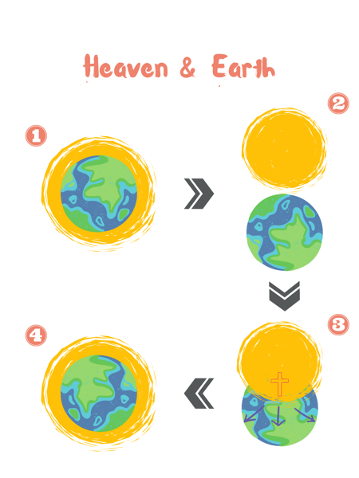
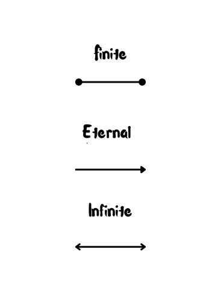
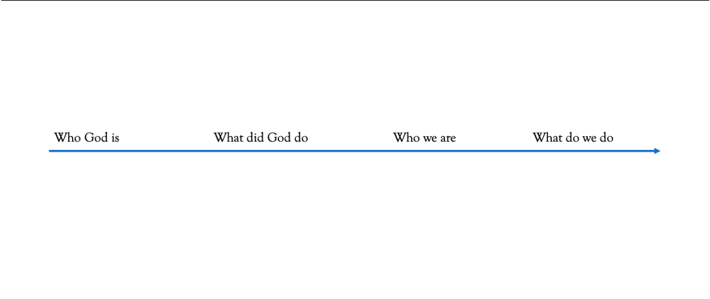
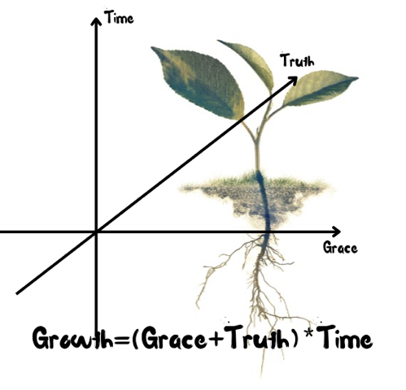

# Planted Vol. 4 — See The Other Side

*(Continuing the program)*

While I was hand standing, the Program Facilitator is going to ask me: "Why are you up-side down?"

I will reply: "What are you talking about? You guys are up-side down!"

What do you see, and how do you feel when you hand stand? Everything looks up-side down, isn't it? This is a perspective shift. When we heard the Kingdom of Heavens Jesus proclaimed, it sounds like an "up-side down Kingdom" – the first will be the last, the weak will be strong, the least will be the greatest… Meanwhile, the world we live in right now feels off. It doesn't feel like the Garden of Delight as God originally designed, but full of brokenness and darkness. What if, it is this world that has been up-side down for so long? What if, it's us who are so used to the state of "hand standing", and didn't realize we were doing it because we were numb and stiff? What if, when our world turned up-side down, we might be able to see the Kingdom of God right side up?

*(Fun activity section)*

Last week we revealed the picture – Jesus's death and resurrection brought the hope of life. The seed that was buried in darkness, sprouted.

This week we will turn the picture up-side down (actually right side up). Remove the dark cloud, the group will see the picture like it below, which represents Jesus points the direction for the seed to grow. Now we know, we were not buried, we are *planted*.

*[Image: a sprout with roots below the soil — kept in Notion; see assets_note.]*

> **Mark 1:15 (NKJV)** — (Jesus preaching the gospel of the kingdom of God) and saying, "The time is fulfilled, and the kingdom of God is at hand. Repent, and believe in the gospel."

The Kingdom of God is at hand. It is an amazing statement of "already here, but yet to come". How can we comprehend it? Christian thinker, writer and teacher Dallas Willard used a brilliant analogy of "the kingdom of electricity" in his classic *The Divine Conspiracy*. In the last century when light bulbs started to become common, people dreamed about what electricity can do in the future, and they could foresee an era of electricity that was on the way. The kingdom of electricity is at hand, they said, while they saw the rich potentials of what electricity can do through a small light bulb. At that moment, "the kingdom of electricity" was already there, but yet to come. To help us understand, would you agree with me that today we can say "the kingdom of AI" is at hand? We can envision what AI can do in our life, but when the era of AI eventually arrives, it might be way beyond the imaginations we have today. My mentor Spencer Marron drew the picture of the statement of "already here, but yet to come" as standing before a storm. When you gaze, a cumulonimbus forming afar in the sky, you can feel some drops of rainwater on your face. Although there's no storm cloud right above your head yet, you can see a storm is arriving. If what I meant "the kingdom of AI is at hand" makes sense to you, you need to understand that there is a bigger storm coming – the Kingdom of God, which is at hand. How can we see that – see the other side of the Kingdom come? It requires us to see it through the lens of faith and see it through the Spirit Jesus already put in each of our hearts.

> **Hebrews 11:1** — Now faith is confidence in what we hope for and assurance about what we do not see.

Maybe some of us used to think about Christianity this way before becoming a Christian:

- humans are bad
- God is good
- whoever believes God goes to heaven, who doesn't believe goes to hell.

This is a common way how the world views Christianity. However, if you have been walking with God, you know that view is not true. What the Bible told us is this:

- God created humans with good plans
- sin separated our intimate relationship with God
- Jesus bore our sins and died on the cross
- Through Jesus' death and resurrection, we can reconcile our relationship with God.

The Bible never tells us that "believing Jesus is a passport to heaven". What the Bible promises is "whoever believes in him shall not perish but have eternal life". Heaven is not "a place we go to after we die", meanwhile, eternity is not mere immortality. Let's think it over. What did Jesus mean when he preached about the Kingdom of heavens and eternal life? Are we able to see the other side of heaven or eternity?

Maybe these diagrams can help visual learners:

1. In the beginning, God created the heavens and the earth. In the garden He planted, the Creator dwells among His creation and enjoys intimate relationship with them. The garden was also called paradise (Greek *paradeisos*).
2. Our first parents sinned and were cast out from the garden of delight. Through human rebellions, we were getting further away from God. The world became up-side down.
3. Jesus' cross built the bridge between heaven and earth, between God's domain and our world, between God and us. Is Jesus bringing the earth to heaven? In the New Testament it sounds more like Jesus is bringing heaven down to earth. (e.g. Philippians 3:20) (As the heaven is invading, the arrows represent the mission of the followers of Jesus – to share the Gospel till the end of the earth.)
4. When Jesus comes back again, heaven and earth will collide. The first heaven and earth will pass away, and there will be a new heaven and new earth. Behold! God's dwelling place is now among the people. (Revelation 21:3)

Any observations? What makes heaven heaven? The answer is the presence of God. Heaven is where the presence of God is. Eden was called paradise because God dwells with His creation. God's posture of humility was revealed from the very beginning of the story. God still longs for dwelling among us again. From the cloud and fire, to the tabernacle and the holy of the holies, and to the temple and each one of us. Today Jesus makes our body as the temple of the Holy Spirit, the dwelling place of God. Don't forget Jesus' name is Emanuel – God with us. For indeed, the kingdom of God is within you (Luke 17:21 NKJV). Heaven is all around us. Kingdom of God is at hand because Jesus is here! The arrival of Jesus indicates that God chooses to dwell with His creation again. Between Jesus' first arrival and the second arrival, heaven is already here and yet to come.

How about eternity?

> **Ecclesiastes 3:11 (NLT)** — Yet God has made everything beautiful for its own time. He has planted eternity in the human heart, but even so, people cannot see the whole scope of God's work from beginning to end.

Eternity is already planted in humanity. It is true. But how could our finite minds comprehend this infinite God character? (here's a simple definition of finite, eternal, and infinite)

We can't. Without the help from the Holy Spirit. Apostle John wrote:

> **1 John 3:24** — The one who keeps God's commands lives in him, and he in them. And this is how we know that he lives in us: We know it by the Spirit he gave us.

In the same letter he wrote to encourage the followers of Jesus to remain in Him, a few paragraphs later it says:

> **1 John 5:11–12** — And this is the testimony: God has given us eternal life, and this life is in his Son. Whoever has the Son has life; whoever does not have the Son of God does not have life.

John told us that eternity is found in life with Jesus. And how do we know that? It's testified by the Spirit of God. People who don't have the Spirit of God try to pursue their meaning and purpose in this contemporary world, which is confronted by the Teacher in Ecclesiastes that all they do is smoke and vapor.

So, what is eternity? Is it either immortality or infinite amount of time? Maybe it's not "either or" but "both and". Eternity is both time and life. Eternity is life with God with is beyond the limitation of the dimension of time. Jesus died on the cross two thousand years ago, but today we can have relationship with him, this is eternal relationship. This is eternal life. Eternity does not start after you die; it starts when you accept Jesus as Lord and Savior. That's the moment when the trajectory of your life is forever changed.

We can't fathom the eternity God planted in our hearts without the help from the Holy Spirit. He is a Helper, and He is the Spirit of Truth. Maybe your prayer this week can be asking the Holy Spirit to construct your eternity perspective. To truly see it. Eternity perspective can lead us to a sense of urgency in the contemporary world where there are so many people don't realize that their life leads to eternal perishment. And there are so many unreached groups. Eternal perspective can also give us a sense of patience. In the spectrum of eternity, there's nothing too big to let go, there's no one that we can't forgive, there's nowhere matters more than the presence of God. Eternity perspective strengthens us to love the unlovable, save one soul at a time, focus on what really matters in this life, and press on running the race of faith.

Kingdom perspective and eternity perspective go hand in hand because heaven is where we enjoy life with God forever. I pray for God to enlarge our borders, to shift our perspectives so that we can understand better the vision and mission of Jesus. We will be able to see the other side as Jesus does. Therefore, we can think as he does, love as he does, on this side of heaven and eternity.

Do you remember the Gospel Flow we learned from the last week? It's basically a timeline. (notice earlier the simple definition of eternal is also a one-direction arrow).

Now we are going to combine the Grid (a framework in the first week) with the Gospel Flow, and add a Z axis to the matrix of Truth and Grace:

We were planted, but that's just the beginning. Watered by truth and grace, over time, the seed grows into a small tree.

I want to end this chapter with this beautiful passage:

> **Psalm 92:12–14**
> The righteous will flourish like a palm tree,
> they will grow like a cedar of Lebanon;
> *planted* in the house of the Lord,
> they will flourish in the courts of our God.
> They will still bear fruit in old age,
> they will stay fresh and green.

(Next week: Chapter 5 – From *Planted* to *Plant*)

---

## Source Extraction — Session S8 (Eternity Planted pilot)

*(Appended in Notion as part of the AGENTS.md SOP pilot.)*

### 1) Source identity

- **Title:** See The Other Side
- **Version / Year:** Undated
- **Source Type:** Framework Source
- **Language:** English

### 2) Core claims

- The Kingdom Jesus proclaims can feel "upside down," and this can function as a **perspective shift**: perhaps the world is upside down, and the Kingdom is "right side up."
- "The kingdom of God is at hand" is framed as **already here, but yet to come**, illustrated through analogies (electricity / AI / storm).
- The Bible is presented as a story of **heaven and earth overlapping** and ultimately reuniting (new creation).
- "Believing Jesus is a passport to heaven" is rejected in favor of "whoever believes… has eternal life" (eternal life framed as more than immortality).
- Eternity is "planted" in the human heart (**Ecclesiastes 3:11**) and requires the Holy Spirit for comprehension.
- Eternity perspective shapes formation: urgency (mission) and patience (forgiveness, letting go, presence).
- The teaching explicitly connects multiple Planted components: Grid + Gospel Flow + Z axis (truth/grace over time).

### 3) Key passages (only those used in this source)

- **Mark 1:15**
- **Hebrews 11:1**
- **Philippians 3:20** (referenced as an example in the diagrams section)
- **Revelation 21:3**
- **Luke 17:21** (NKJV)
- **Ecclesiastes 3:11**
- **1 John 3:24**
- **1 John 5:11–12**
- **Psalm 92:12–14**

### 4) Biblical-theological themes

- Kingdom (already/not yet; "at hand")
- Heaven and earth (overlap → reunion)
- God's presence / dwelling (heaven defined by presence)
- Eternal life (life with Jesus; Spirit testimony)
- Already and not yet
- Faith (seeing what is not seen)
- Grace, truth, and time (Grid + Gospel Flow + Z axis)
- Formation: urgency + patience

### 5) Strong original language (preserve)

- "What if… it is this world that has been up-side down for so long?"
- "The kingdom of AI is at hand… there is a bigger storm coming — the Kingdom of God."
- "Heaven is where the presence of God is."
- "Eternity does not start after you die; it starts when you accept Jesus as Lord and Savior."
- "We were not buried, we are *planted*."
- Tree/forest trajectory (seed → tree), watered by truth and grace over time.

### 6) Discussion material

- Teaching prompts embedded as questions:
  - "Why are you up-side down?" / "What do you see and how do you feel?"
  - "Any observations? What makes heaven heaven?"
- Visual aids:
  - Multiple diagrams (heaven/earth overlap; finite/eternal/infinite; Gospel Flow; Grid + Z axis).
- Formation prompt:
  - "Maybe your prayer this week can be asking the Holy Spirit to construct your eternity perspective."

### 7) Formation applications

- Pray for the Holy Spirit to reshape perspective (Kingdom and eternity).
- Practice urgency and patience:
  - urgency toward mission and "unreached groups"
  - patience in forgiveness and prioritizing God's presence
- Live with "faith" as assurance in what is not seen (Hebrews 11:1), especially regarding Kingdom realities.

### 8) Unique contribution

- Provides the richest **illustration/analogy toolkit** (electricity/AI/storm; handstand; diagrams).
- Explicitly integrates Session 8's conceptual goal (eternity begins now) with the broader Planted architecture (Grid + Gospel Flow + time axis).

### 9) Repetition (duplicated across Session 8 sources)

- "Already here, yet to come" framing overlaps with Already/Not Yet EN.
- Eternal life "begins now" overlaps with Week 12.
- Heaven defined as presence overlaps with Week 12.

### 10) Human Review Needed

- **Exegetical verification:** "the kingdom of God is within you" (Luke 17:21 NKJV) is used strongly; ensure canonical notes handle translation/interpretive nuance carefully.
- **Diagram dependency:** key points may rely on diagrams; decide what must be preserved visually vs. restated in text for Leader Notes.
