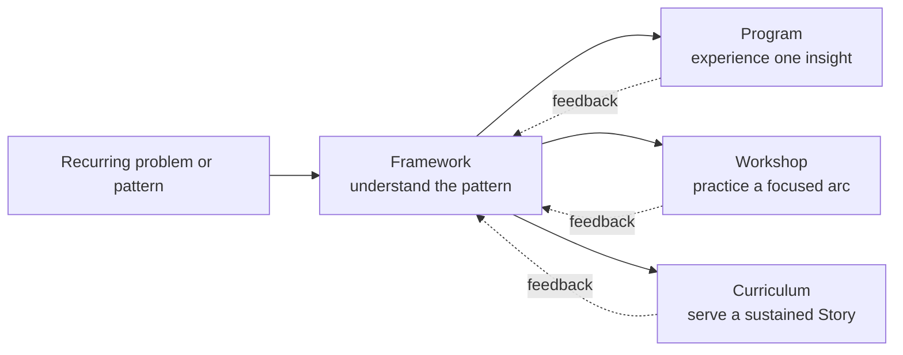

# Frameworks MOC

## Orientation

A framework is a portable model that helps people understand Scripture, discern reality, guide formation, make decisions, or act faithfully. Frameworks are maps rather than the territory: they clarify patterns but must not flatten mystery, replace Scripture, or become universal formulas.

## Framework constellations

### Biblical Story and fulfillment

- [[Already Not Yet]] — the Kingdom inaugurated in Christ and awaiting consummation
- [[Exodus Road]] — the way out, way through, and way in
- [[Garden Framework]] — receive, cultivate, bear fruit, and multiply
- [[Gospel Flow]] — God's identity and action ground Christian identity and response
- [[Seed-Form Typology]] — historical realities grow toward fuller realization in Christ and new creation
- [[Five Echoes]] — a listening guide for prophetic orientations toward God, Story, heart, communal life, and future hope
- [[T2T]] — tabernacle to temple, then temple identity expressed as tabernacling worship, witness, and hospitality

### Formation and discipleship

- [[Belonging Beholding Becoming]] — covenant identity, attention to Christ, and Spirit-enabled transformation
- [[Faith Muscle]] — repeated practices of trust and obedience
- [[Know Grow Go|Know Grow Go]] — know God, grow into Christlikeness and purpose, and go in love and mission
- [[Embody the Voice]] — bear witness to the Word by seeing, feeling, speaking, living, and hoping

### Interpretation, discernment, and action

- [[Grace Truth Matrix]] — hold truthful clarity and gracious love together
- [[HABITS]] — cultivate humility, attention, bias awareness, integrity, teachability, and stewardship of truth in the knower
- [[Ontology Eschatology Matrix]] — discern the reality assumed and future served by a practice
- [[PLANT]] — prayerful evangelistic attention and action
- [[SOAP]] — Scripture, observation, application, and prayer

### Communal formation

- The conceptual movement Foundation → Frame → Dwelling now lives pedagogically within [[Building A House]].
- [[Belonging Beholding Becoming]], [[Grace Truth Matrix]], and [[Know Grow Go|Know Grow Go]] frequently combine when designing communal formation.

## Choosing frameworks by task

| Task | Useful frameworks |
|---|---|
| Read a passage | [[SOAP]], [[Seed-Form Typology]], [[Gospel Flow]]; [[Five Echoes]] for prophetic literature |
| Explain salvation and discipleship | [[Exodus Road]], [[Gospel Flow]], [[Already Not Yet]] |
| Trace temple identity into Church mission | [[T2T]], [[Seed-Form Typology]], [[Already Not Yet]] |
| Design formation | [[Belonging Beholding Becoming]], [[Faith Muscle]], [[Garden Framework]], [[Embody the Voice]] |
| Practice faithful knowing and truth stewardship | [[HABITS]], [[Grace Truth Matrix]], [[Ontology Eschatology Matrix]] |
| Discern a pastoral or ethical response | [[Grace Truth Matrix]], [[Ontology Eschatology Matrix]] |
| Plan accompaniment and mission | [[Know Grow Go|Know Grow Go]], [[PLANT]], [[Garden Framework]] |

For a curriculum or workshop, prefer one governing story framework, one formation framework, and one action framework rather than stacking every available model.

## From framework to experience

Examples:

- [[Grace Truth Matrix]] → [[The Grid]]
- [[Already Not Yet]] → [[Learning to Handstand in 5 Minutes]] and [[Eternity Planted]]
- [[Exodus Road]] → [[The Exodus Road Workshop]]
- Foundation → Frame → Dwelling → [[Building A House]]

If the primary value becomes undergoing an experience rather than understanding a model, classify the artifact as a program and preserve the conceptual content there.

## Maturity map

### Developed

[[Belonging Beholding Becoming]], [[Exodus Road]], [[Faith Muscle]], [[Gospel Flow]], [[Grace Truth Matrix]], [[Know Grow Go|Know Grow Go]], [[PLANT]], [[SOAP]], [[Seed-Form Typology]]

### Developing

[[Already Not Yet]], [[Embody the Voice]], [[Five Echoes]], [[Garden Framework]], [[HABITS]], [[Ontology Eschatology Matrix]], [[T2T]]

Maturity describes internal coherence and use. It does not equal ministry approval or publication.

## Stewardship questions

- What problem does this framework solve better than ordinary prose?
- What is its biblical and theological grounding?
- What does each component mean, and how do the parts relate?
- What example shows the model working in context?
- What does it leave out, and how could it be misused?
- What is original, received, adapted, or permission-dependent?
- What evidence from real use warrants greater maturity?

## Operational index

- [[00_Framework_Library|Framework Library]] — categorized inventory and maintenance guide
- [[60 Framework Template]] — development form
- [[Programs_MOC|Programs MOC]] — embodied expressions
- [[Workshops MOC]] — focused formation expressions
- [[03 Publishing and Stewardship Pipeline]] — publication requirements
