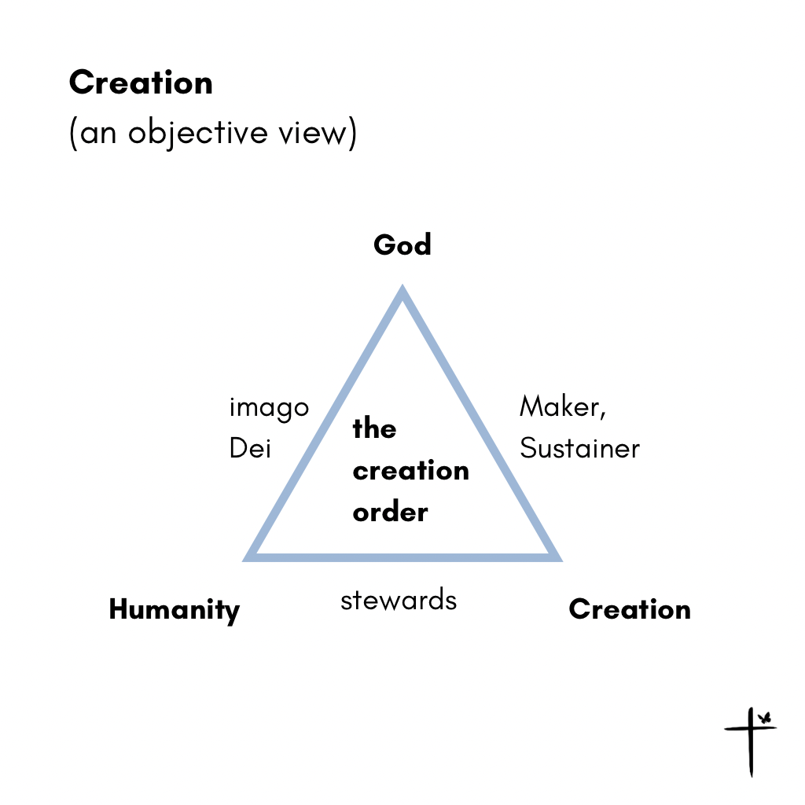
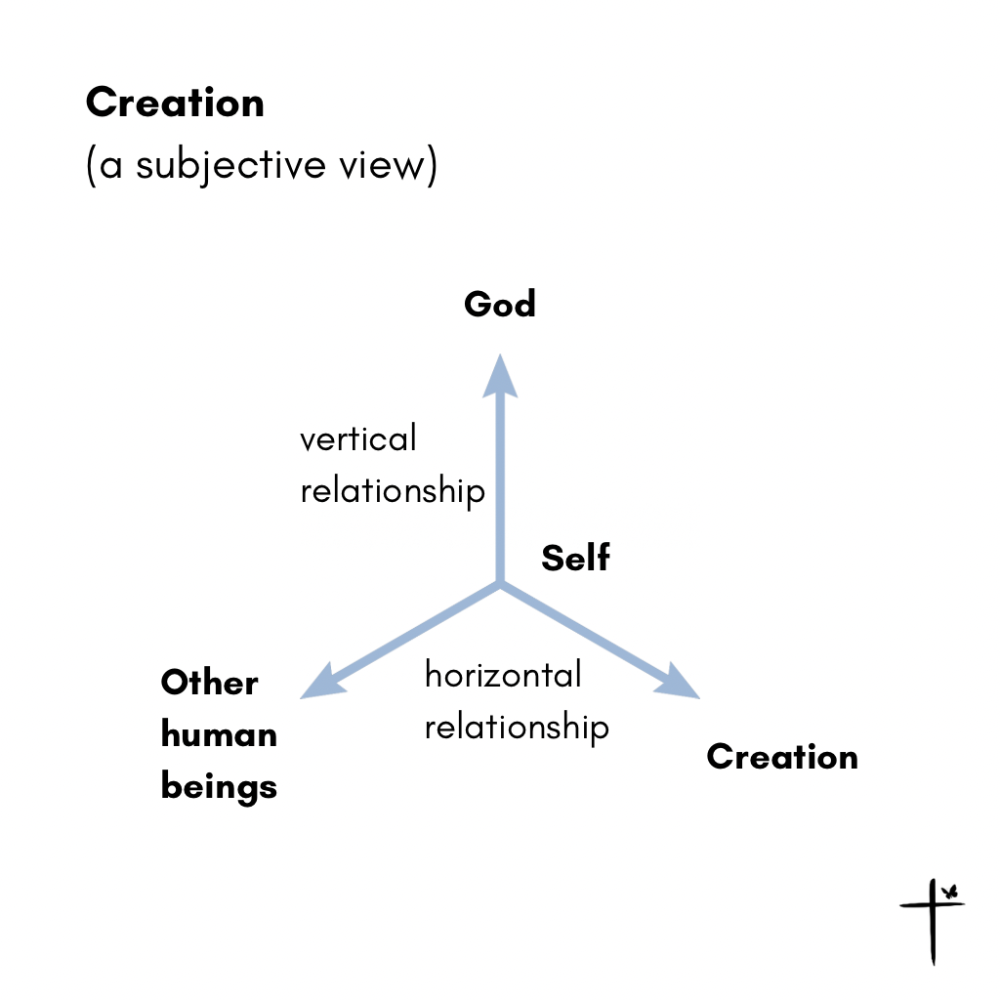
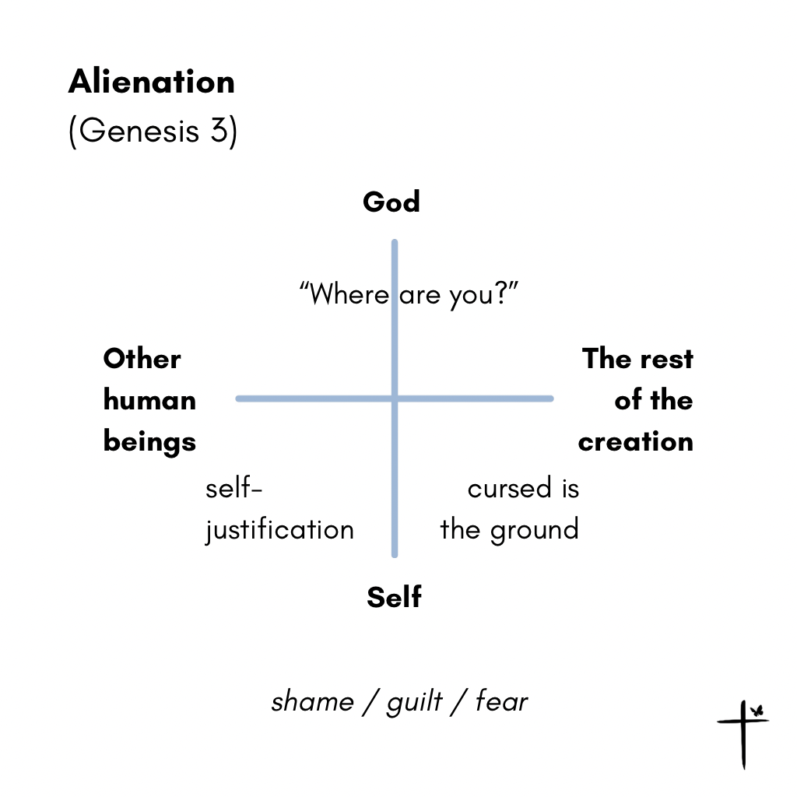
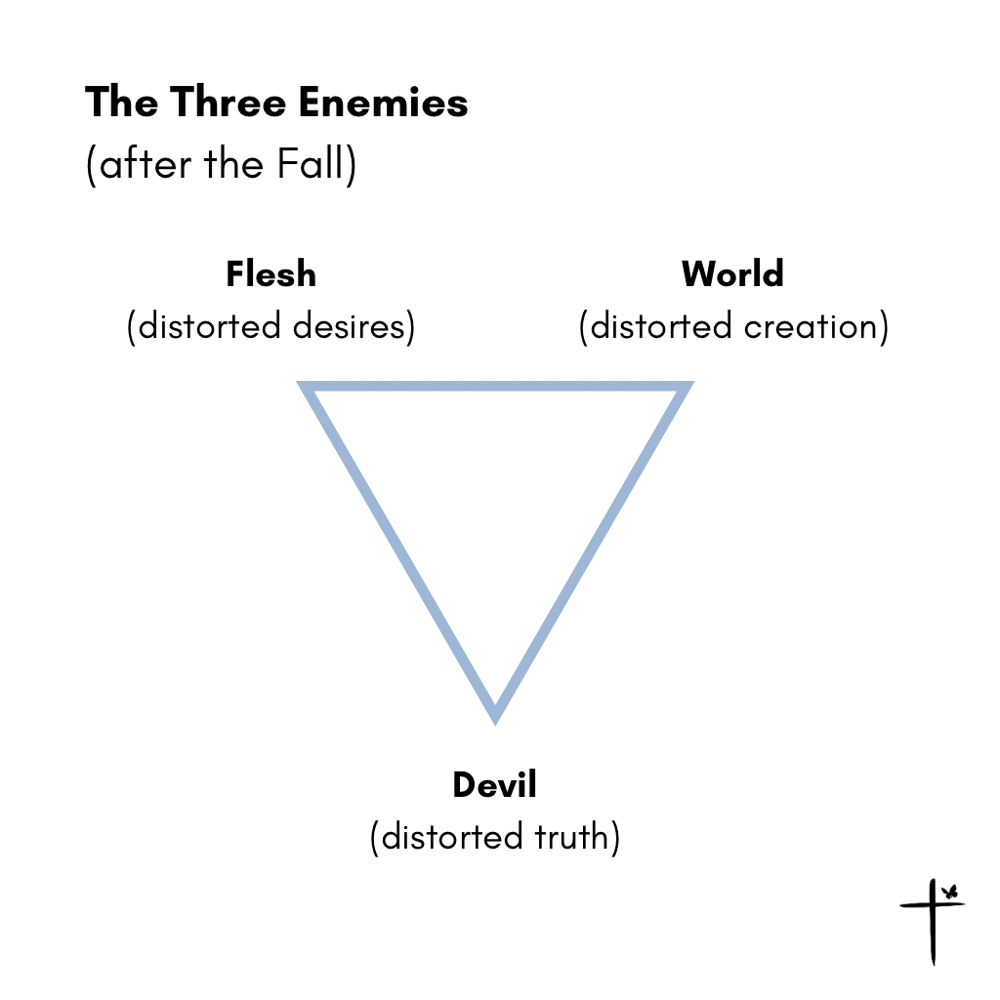
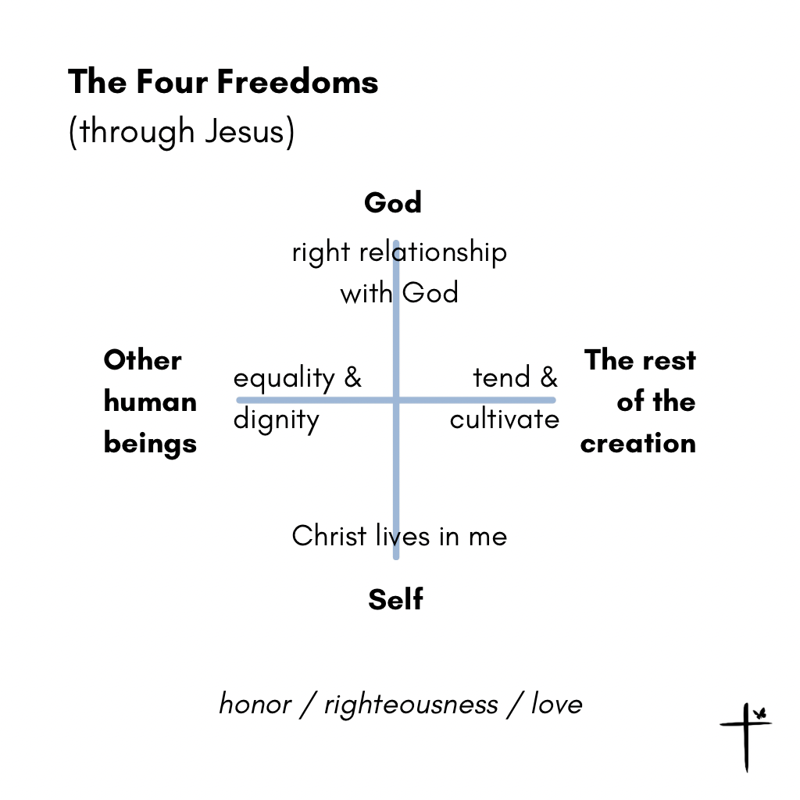
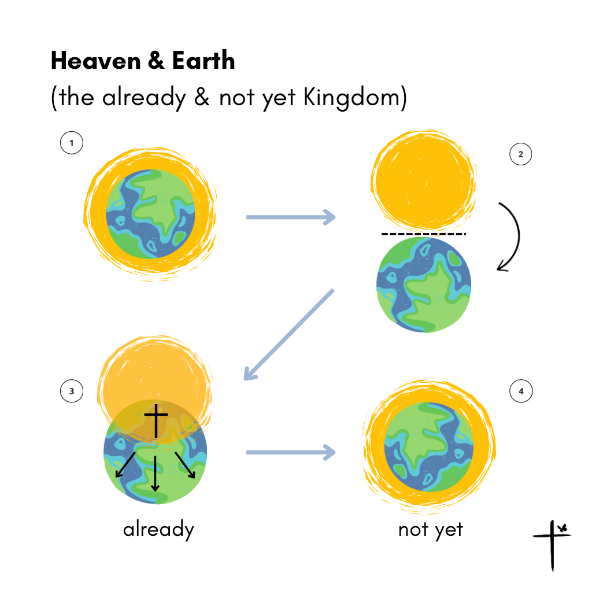
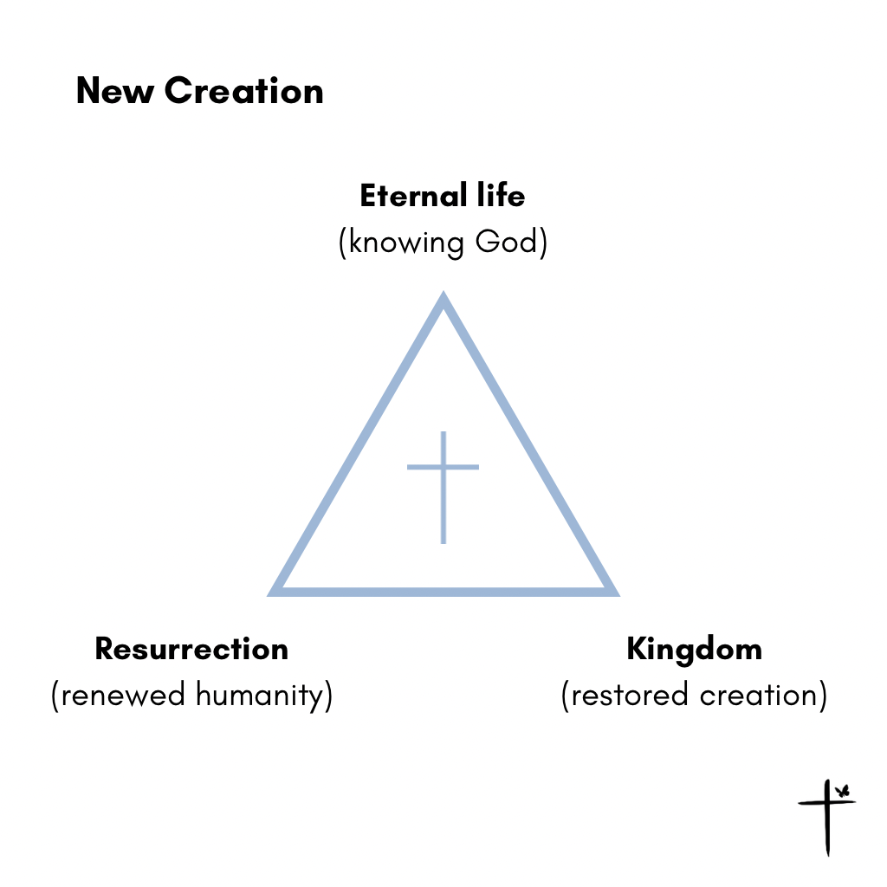

# Planted. — Resource Library

## Book Club

### Chapter 1 — There Is A Garden Named Delight

1. *The Good and Beautiful God* by James Bryan Smith
2. *Being God's Image* by Carmen Joy Imes

### Chapter 2 — Devil Not Today

1. *Live No Lies* by John Mark Comer
2. *Don't Give the Enemy a Seat at Your Table* by Louie Giglio

### Chapter 3 — Breakdown Is the Beginning of Breakthrough

1. *Beautiful Outlaw* by John Eldredge
2. *Surprised by Hope* by N. T. Wright

### Chapter 4 — See the Other Side

1. *All Things New* by John Eldredge
2. *Eternity Is Now in Session* by John Ortberg

### Chapter 5 — From Planted to Plant

1. *Life Together* by Dietrich Bonhoeffer
2. *After You Believe* by N. T. Wright

## Storyline Diagrams

